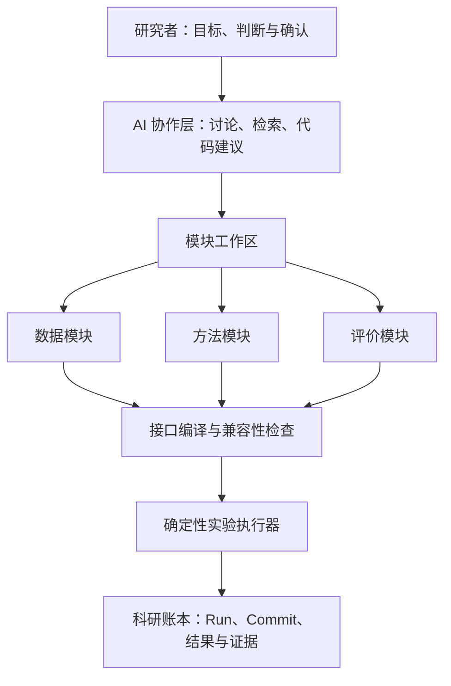
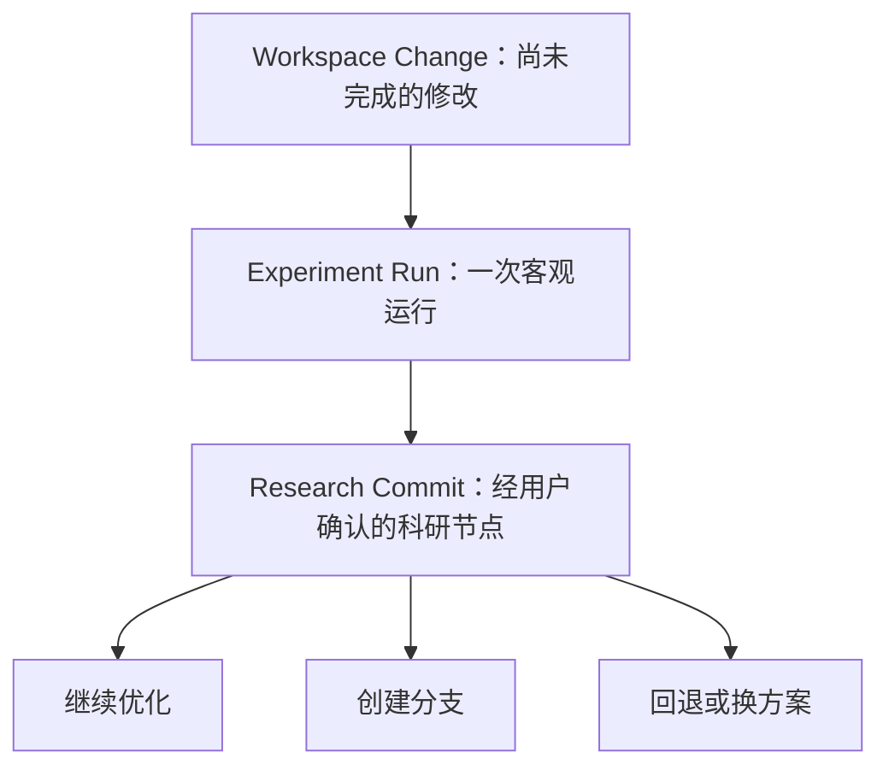
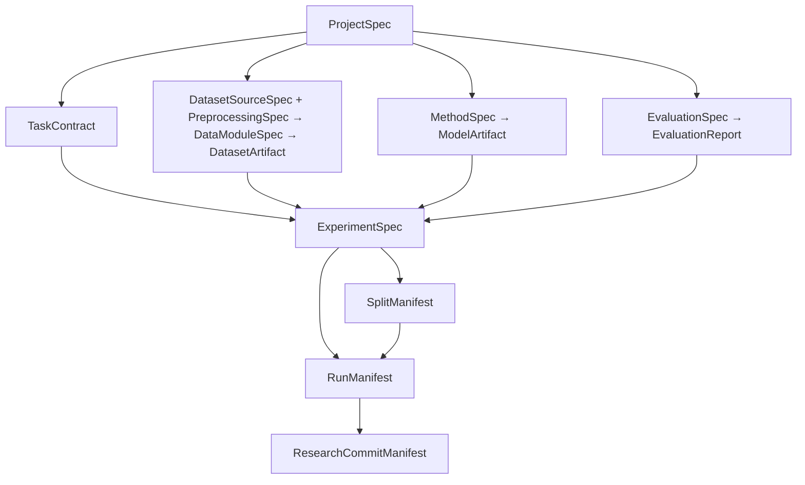

# AI4SOTA

> 一个面向算法科研的人机协作桌面 IDE：研究者通过“数据、方法、评价”三个可替换模块组织实验，AI 负责资料检索、方案讨论、基础代码生成、修改建议与结果整理，研究者始终负责关键判断、代码确认和实验验收。

## 1. 项目状态

AI4SOTA 桌面版 v1 的产品与架构设计已经确认，产品代码尚未按新架构实施。批准的规格见 `docs/superpowers/specs/2026-09-05-ai4sota-desktop-agent-design.md`，三阶段执行入口见 `docs/superpowers/plans/2026-09-05-ai4sota-implementation-program.md`。

第一阶段以本地桌面应用为目标，优先支持表格数据和 EEG/ECG 等生理时序分类任务。底层接口需要保留扩展到图像、文本、图网络和多模态任务的能力，但 MVP 不追求一次覆盖所有数据与算法。

## 2. 为什么做 AI4SOTA

算法科研通常反复处理三部分内容：

1. **数据**：读取、清洗、预处理、样本组织和数据划分。
2. **方法**：特征工程、模型结构、损失函数、训练与推理。
3. **评价**：性能指标、交叉验证、统计检验、可解释性和科研图表。

现实中，这三部分往往耦合在同一批脚本里。更换数据、模型或评价方案时，需要大量复制和修改代码；实验运行后，又很难准确回答：

- 这次实验究竟改了什么？
- 指标提升来自模型，还是来自数据划分变化？
- 当时为什么采用这个方案？
- 哪段代码对应哪篇论文？
- 某个失败方法是否已经尝试过？
- 几个月后能否完整复现实验？

AI4SOTA 希望把科研过程组织成可讨论、可修改、可组合、可比较和可回退的模块化工作流。

## 3. 产品定位

AI4SOTA 不是一个完全由 AI 自主决策的 AutoML 系统，也不是让 AI 在后台无限试错、自动追逐最高指标的软件。

它更接近以下工具的结合：

- Cursor/VS Code：代码编辑与 AI 辅助修改；
- Orange/KNIME：可视化模块连接；
- Git：代码版本和差异管理；
- MLflow：参数、指标、日志与产物记录；
- DVC：数据和大型产物版本；
- 文献检索助手：论文搜索、方法梳理和证据关联。

核心原则是：

> AI 提供信息和执行能力，人提供科研判断；系统负责接口约束、确定性执行和完整记录。

## 4. 明确不做什么

MVP 阶段不做以下事情：

- 不让 AI 未经确认自动改变研究问题、数据划分或主评价指标；
- 不把所有数据强制转换成同一种物理文件格式；
- 不承诺读取没有格式说明的加密或私有二进制数据；
- 不在第一版实现完整 AutoML、集群调度和多机训练；
- 不在第一版建立大型插件市场；
- 不把 AI 生成的代码直接静默覆盖用户代码；
- 不把每一次临时调试都当作正式科研结论。

## 5. 总体架构



系统由五个主要部分组成：

1. **项目与模块工作区**：管理项目、文件、代码、对话和模块状态。
2. **数据—方法—评价三类模块**：允许独立开发、独立测试和自由组合。
3. **接口编译器**：检查模块是否兼容，并生成必要的连接适配代码。
4. **实验执行器**：按照已确认的配置运行代码，保存日志和产物。
5. **科研账本**：记录每次运行、正式实验版本、代码差异、指标和结论。

## 6. 核心概念

### 6.1 Project

一个完整的科研任务，例如“基于 MIT-BIH 的早搏分类”或“儿童工作记忆 EEG 动态网络分析”。

用户新建项目时：

1. 填写项目名称和研究目标；
2. 上传数据文件或选择数据目录；
3. 选择项目输出目录；
4. 系统在输出目录生成完整工程骨架；
5. 后续代码、配置、实验结果和版本记录均保存在该目录中。

### 6.2 Module Workspace

画布上显示数据、方法、评价三个模块。双击任意模块进入独立工作区：

- 左侧：模块文件、版本与参考资料；
- 中间：代码编辑器；
- 右侧：当前模块专属 AI 对话；
- 下方：运行日志、测试结果与输出预览；
- 顶部：模块接口、方案说明和当前状态。

### 6.3 Module Version

数据、方法和评价模块都拥有独立版本。例如：

```text
data/eeg-preprocess@1.3
method/fbcnet@2.1
evaluation/subject-cv@1.0
```

### 6.4 Experiment Run

一次真实程序运行。每个 Run 自动保存：

- 三个模块的版本；
- 完整运行配置；
- 参数和随机种子；
- 代码快照；
- 标准输出与错误日志；
- 指标、图表、模型权重和中间产物；
- 开始时间、结束时间、运行状态和硬件环境。

Run 是客观运行记录，不等于正式科研结论。

### 6.5 Research Commit

用户检查一个或多个 Run 后，可将其保存为正式科研节点。Research Commit 除了代码和结果，还保存：

- 研究假设；
- 修改原因；
- 相对父版本的变化；
- 引用的论文或资料；
- 实验结果；
- 用户确认的结论；
- 是否接受该方案；
- 下一步计划。

### 6.6 Artifact

实验产生或使用的可追踪对象，包括数据缓存、划分清单、模型权重、预测结果、图表、日志和报告。大型 Artifact 使用路径和内容哈希引用，不直接写入普通 Git 历史。

### 6.7 TaskContract 与 ExperimentSpec

`TaskContract` 是项目级共享语义契约，统一定义预测单位、目标类型、类别本体、标签编码、未知或缺失标签策略、模型输出含义和结果聚合单位。数据、方法和评价模块必须引用同一个契约并分别声明其映射、能力或要求，不能只凭 `classification` 等宽泛名称判断兼容。

`TaskContract` 不是第四类插件。`ExperimentSpec` 也不是插件，而是一次待执行实验的不可变组合记录：它选择三个模块的精确版本或内容哈希、一个激活的 `TaskContract`、跨模块映射、生成的适配器、评价协议和运行配置。

## 7. 三类模块的统一结构

每个模块不是一段孤立代码，而是一个可独立维护的“小型研究胶囊”。

```text
module/
├── README.md              # 模块目的、方案和使用说明
├── module.yaml            # 模块类型、接口和能力声明
├── src/                   # 源代码
├── configs/               # 可运行配置
├── tests/                 # 单元测试和接口测试
├── references/            # 论文、链接和证据索引
├── discussions/           # 经用户确认后保存的关键讨论摘要
└── artifacts/             # 小型示例输出或产物索引
```

模块具有以下状态：

1. `discussing`：正在讨论方案；
2. `confirmed`：方案和接口已经由用户确认；
3. `coding`：正在生成或修改代码；
4. `testing`：正在进行模块测试；
5. `ready`：测试通过，可以接入实验；
6. `changed`：代码或接口改变，需要重新检查；
7. `deprecated`：已保留历史，但不建议继续使用。

## 8. 数据模块：Schema 驱动的数据适配系统

### 8.1 目标

原始数据可以来自 CSV、Excel、MAT、NPY、NPZ、HDF5、EDF/BDF、WFDB、图片目录、JSON、文本或其他文件组织方式。用户不需要手工把全部数据改造成固定文件。

用户只需通过表单、自然语言对话或 YAML 描述：

- 文件在哪里、如何组织；
- 一个样本是什么；
- 输入字段和标签在哪里；
- 每个维度代表什么；
- 被试、试次、时间和通道等元数据在哪里；
- 数据任务以及可用于划分的样本、被试、会话和试次标识是什么。

Agent 根据定义和少量样例文件生成读取、转换、验证和测试代码，将原始数据转换成统一的逻辑接口。

### 8.2 统一逻辑接口，而非统一物理文件

不同模态不适合强制保存成同一种文件。AI4SOTA 统一的是程序访问协议：

```python
sample = {
    "inputs": {
        "signal": ...,
    },
    "targets": {
        "label": ...,
    },
    "metadata": {
        "sample_id": ...,
        "subject_id": ...,
        "trial_id": ...,
    },
}
```

统一数据对象建议为：

```python
class CanonicalDataset:
    schema: dict
    metadata: dict
    provenance: dict

    def __len__(self) -> int:
        ...

    def __getitem__(self, index: int) -> dict:
        ...
```

底层数据仍可按类型选择最合适的存储：

| 数据类型 | 推荐存储 |
|---|---|
| 小型表格 | Parquet/CSV |
| 小型数组 | NPZ |
| 大型时序或脑电 | Zarr/HDF5 |
| 图像 | 原始文件加索引表 |
| 文本 | Parquet/JSONL |
| 图网络 | 图对象文件加统一索引 |
| EDF/BDF/WFDB | 保留原文件并延迟读取 |

### 8.3 两级适配

数据连接模型需要两个明确步骤：

```text
原始文件
  ↓ Source Adapter
CanonicalDataset
  ↓ Model Input Adapter / Collator
模型 Batch
```

- **Source Adapter**：解决文件格式、文件结构、字段名称和原始维度问题。
- **Model Input Adapter**：解决维度顺序、Batch、填充、掩码和模型输入名称问题。

这样，数据模块不会绑定某一个具体模型。

### 8.4 数据卡片内部的三个 Schema

界面上仍然只有一个数据模块卡片，但持久化时将变化频率不同的内容拆开：`DatasetSourceSpec` 保存数据来源事实，`PreprocessingSpec` 保存可替换的处理方案，`DataModuleSpec` 绑定两者并声明统一输出。这样同一个 EEG 数据集可以复用多套预处理，而修改滤波方案不会伪装成数据来源发生变化。

```yaml
api_version: ai4sota/v1
kind: dataset_source
id: dataset/child_working_memory@1

identity:
  modality: eeg
  description: 儿童 1-back 和 2-back 工作记忆 EEG
  license: restricted-research

source:
  format: mat
  root: ./raw_data
  file_pattern: "sub-*/epochs.mat"
  sample_unit: trial

fields:
  signal:
    location: epochs
    axes: [trial, channel, time]
    dtype: float64
    unit: microvolt
  source_label:
    location: labels.memory_group
  subject_id:
    source: file_path
    pattern: "sub-(\\d+)"
  condition:
    location: labels.condition

acquisition:
  sampling_rate_hz: 250
  channel_names_source: channel_names
  variable_length: false

fingerprint_manifest: data/fingerprints/source.json
---
api_version: ai4sota/v1
kind: preprocessing
id: preprocessing/working_memory_eeg@1

transforms:
  - type: detrend
  - type: bandpass
    low_hz: 1
    high_hz: 45
  - type: standardize
    fitted_state_scope: train_partition_only

output:
  sample_layout: CT
  dtype: float32
---
api_version: ai4sota/v1
kind: data_module
id: data/working_memory_eeg@1

source_ref: dataset/child_working_memory@1
preprocessing_ref: preprocessing/working_memory_eeg@1
task_contract: tasks/working_memory_group.yaml
entrypoint: src.dataset:build_dataset

task_mapping:
  target: source_label
  labels:
    low: 0
    high: 1

output_contract:
  canonical_type: supervised_timeseries
  required_metadata: [sample_id, subject_id, channel_names, sampling_rate_hz]

validation:
  required_fields: [inputs.signal, targets.label, metadata.subject_id]
  checks: [finite_values, unique_sample_id, consistent_channels]
```

用户不必直接手写全部 YAML。桌面端应通过“数据描述向导 + AI 对话”生成草稿，再让用户确认关键语义。

### 8.5 Agent 生成的数据模块

```text
modules/data/current/
├── source.yaml
├── preprocessing.yaml
├── module.yaml
├── reader.py
├── dataset.py
├── transforms.py
├── collate.py
├── validation.py
├── tests/
│   ├── test_reader.py
│   ├── test_shapes.py
│   └── test_group_metadata.py
└── validation_report.json
```

生成流程：

1. 扫描文件名、目录结构和少量样例；
2. 推断可确定的格式、字段、dtype 和 shape；
3. 对不确定的语义向用户提问；
4. 生成 `source.yaml`、`preprocessing.yaml` 和 `module.yaml` 草稿；
5. 用户确认数据定义；
6. 生成读取器、Dataset、变换和测试代码；
7. 执行数据验证；
8. 展示样本、标签分布、缺失情况、维度和划分预览；
9. 用户验收并保存数据模块版本。

### 8.6 自动操作与人工确认边界

Agent 可以自动完成机械性转换：

- 读取已知格式；
- dtype 转换；
- 明确的轴转置；
- 构建文件索引；
- Batch 拼接；
- 标签字符串编码；
- 延迟加载和缓存；
- 缺失字段及维度检查。

以下操作会改变科研含义，必须显示方案并由用户确认：

- 滤波、重采样、插值和去伪迹；
- 删除异常或缺失样本；
- 类别合并和标签重映射；
- 截断、填充或切窗；
- 归一化范围；
- 训练、验证、测试集划分；
- 被试内、跨被试或跨数据集设置；
- 数据增强和样本重采样。

Agent 不得为了让代码运行而静默改变数据含义。

### 8.7 数据验证报告

每个数据版本至少生成：

- 文件数量和可读取比例；
- 样本数量；
- 输入 shape、dtype、数值范围和单位；
- 标签类别及分布；
- NaN/Inf/缺失值；
- 重复样本 ID；
- 通道或特征一致性；
- 可变长度情况；
- 可用分组字段、唯一值数量和缺失比例；
- 生成 `SplitManifest` 后由评价模块执行分区分布与被试/组别泄漏检查；
- 原始数据、定义文件和标准化缓存的内容哈希。

## 9. 方法模块

方法模块不只表示一个神经网络类，还应包含完整建模流程：

- 特征工程；
- 模型结构；
- 损失函数；
- 优化器与训练器；
- 超参数；
- 推理接口；
- 模型保存与加载；
- 可输出的概率、特征、注意力或其他中间表示。

### 9.1 MethodSpec 示例

```yaml
api_version: ai4sota/v1
kind: method

method:
  name: fbcnet_baseline
  framework: pytorch

input_contract:
  canonical_type: supervised_timeseries
  inputs:
    eeg:
      layout: BCT
      dtype: float32
      channels: 30
      fixed_length: 500
  required_metadata:
    - subject_id
    - channel_names
    - sampling_rate_hz

backbone:
  entrypoint: src.model:FBCNetBackbone
  output: embeddings

heads:
  - id: working_memory_group
    task_contract: tasks/working_memory_group.yaml
    type: classification
    num_classes: 2
    outputs: [logits, probabilities]

objectives:
  - head: working_memory_group
    loss: cross_entropy

training_recipe:
  epochs: 100
  batch_size: 32
  optimizer: adam
  learning_rate: 0.001

inference:
  outputs: [logits, probabilities, embeddings]

checkpoint:
  load_policy: strict_compatible
  save: best_primary_metric

search_space:
  learning_rate:
    type: log_float
    low: 0.00001
    high: 0.01
  hidden_size:
    type: categorical
    values: [64, 128, 256]
```

### 9.2 方法模块工作流

1. 用户与 AI 讨论任务目标和候选基线；
2. AI 检索并整理相关论文、开源实现和适用条件；
3. 用户选择要复现或改进的方法；
4. AI 生成基础代码和单元测试；
5. 用户查看 diff，接受、部分接受或拒绝修改；
6. 方法模块独立通过前向传播、损失计算和小样本训练测试；
7. 保存模块版本并接入实验。

任何论文复现都应记录论文信息、原始实现链接、采用的结构、未能复现的细节和本项目做出的假设。

## 10. 评价与解释模块

评价模块是独立的一等模块，不能只是训练脚本末尾的几个指标函数。

它应包括：

- 主指标与辅助指标；
- 数据划分和交叉验证协议；
- 多随机种子；
- 被试级或样本级聚合；
- 置信区间；
- 显著性检验；
- 数据泄漏与鲁棒性检查；
- 可解释性方法；
- 最终图表和实验报告。

### 10.1 EvaluationSpec 示例

```yaml
api_version: ai4sota/v1
kind: evaluation

evaluation:
  name: subject_level_classification
  task_contract: tasks/working_memory_group.yaml

requires:
  - ground_truth
  - probabilities
  - predictions
  - subject_id

protocol:
  cross_validation:
    type: stratified_group_kfold
    n_splits: 5
    group_by: subject_id
  random_seeds: [7, 17, 27]

metrics:
  primary: macro_f1
  secondary:
    - accuracy
    - balanced_accuracy
    - roc_auc
    - sensitivity
    - specificity

statistics:
  bootstrap_confidence_interval:
    enabled: true
    confidence: 0.95

explainability:
  - confusion_matrix
  - feature_importance
  - temporal_attribution

outputs:
  - metrics.json
  - fold_metrics.csv
  - predictions.parquet
  - confusion_matrix.png
  - evaluation_report.md
```

主评价协议一旦确认，应默认锁定。改变测试集、划分方式或主指标时，系统必须提示这会影响历史实验的直接可比性。

数据与评价的职责必须分开：数据模块只输出稳定的 `sample_id`、`subject_id`、`session_id`、`run_id`、`trial_id` 等可用标识，并声明哪些字段存在；评价模块定义随机划分、Group 划分、交叉验证和泄漏约束。接口编译器在运行前依据两者生成包含精确样本成员关系的 `SplitManifest`，经确认后随 Run 快照冻结。更换划分协议不得要求复制或修改数据模块。

## 11. 接口编译与兼容性检查

连接三个模块前，系统读取它们的能力声明并进行静态检查。

典型问题包括：

- 数据输出为 `C×T`，模型声明输入为 `T×C`；
- 数据没有 `subject_id`，评价模块却要求被试级交叉验证；
- 模型只输出类别，评价模块要求概率和 ROC-AUC；
- 可解释性模块要求梯度，但模型是非可微的传统分类器；
- 模型要求固定长度500，数据样本长度不一致；
- EEG 地形图需要通道名称和 montage，但数据定义没有提供。

处理原则：

1. `compatible`：表示和语义要求完全匹配，可以进入运行审批；
2. `adaptable`：只需版本化白名单中的机械适配，例如轴转置、Batch、Mask Collation 和安全 dtype 转换，系统可生成并展示适配器；
3. `requires_decision`：涉及通道、采样、标签映射、缺失值或其他科研语义，必须由研究者明确决定并留下记录；
4. `incompatible`：缺少无法机械补足的字段或能力，禁止运行并给出字段级原因；
5. 接口改变后，所有受影响的下游模块标记为 `changed`，重新编译兼容性；
6. 编译器基于 Schema 和版本化规则产生确定性结果与 Contract Hash；AI 可以解释结果和提供补丁，但不能覆盖判定、扩大机械适配白名单或静默修改下游模块。

存在未解决的 `requires_decision` 或任何 `incompatible` 结果时，Run 审批入口保持禁用。机械适配器的代码与哈希也必须进入 `ExperimentSpec` 和 Run 快照。

## 12. 人与 AI 的协作方式

### 12.1 默认模式：协作模式

AI 可以：

- 询问缺失的数据语义；
- 检索论文和开源项目；
- 比较多个候选方案；
- 生成代码骨架、配置和测试；
- 根据错误日志给出补丁；
- 总结运行结果；
- 起草 Research Commit 的说明和结论。

用户负责：

- 确认研究问题；
- 确认数据语义和处理方案；
- 选择方法和基线；
- 确认评价协议；
- 审查代码 diff；
- 决定是否运行；
- 确认实验结论和是否保留版本。

### 12.2 AI 修改代码的规则

在默认协作模式下，AI 可以直接修改当前激活模块的项目内工作副本；不得跨模块静默修改，也不得把工作区修改自动视为已接受的科研版本。每次修改都应形成可检查、可撤销的补丁记录，展示：

- 修改目的；
- 修改文件；
- 修改前后 diff；
- 参考依据；
- 可能影响；
- 需要重新运行的测试。

用户可以查看、部分保留或撤销工作区修改，也可以切换为更严格的“应用前预览”模式。启动实验、发布模块版本和创建 Research Commit 始终需要用户明确确认。

### 12.3 可选运行模式

- **手动模式**：用户写代码、设参数并启动实验；
- **协作模式**：AI 提候选方案和补丁，用户确认后执行；
- **授权自动模式**：用户限定参数范围、预算和停止条件后，系统执行批量实验。

MVP 默认只实现手动模式和协作模式。

### 12.4 VS Code 与外部修改

AI4SOTA 与 VS Code 直接操作同一个项目目录，不维护需要双向同步的工程副本。桌面端递归监听项目内的代码、Schema、配置、测试和参考资料；检测到普通外部修改后自动刷新文件索引和模块状态。

Agent 在分析、修改、验证和执行前重新读取相关文件。每个补丁绑定生成时的文件内容哈希；如果 VS Code 已修改任一补丁目标，系统不得覆盖文件，而应停止整组写入并让用户查看冲突。文件监听只用于及时反馈，关键操作前必须再次核对磁盘内容，避免漏失事件造成旧内容覆盖。

启动 Run 时，系统冻结代码、Schema、配置、生成适配器、划分清单、环境信息和内容哈希，并从独立快照执行。运行开始后的 VS Code 修改只影响后续 Run。大型原始数据不为每次 Run 整体复制，而是记录数据清单和强指纹；若运行期间检测到相关数据变化，该 Run 标记为数据完整性异常，不能用于默认的公平比较。

### 12.5 模型 Provider

第一版同时支持托管 API 和本地 OpenAI-compatible 端点。Agent 对话、工具和项目记录属于 AI4SOTA，不依赖某个 Provider 保存会话，因此项目可以切换模型而不丢失本地历史。

每个 Provider 配置记录端点类型、Base URL、模型 ID、凭据引用、能力和数据发送策略。系统在配置时检测流式输出、工具调用、结构化输出、视觉或文件输入等能力；不支持可靠工具调用的模型仍可用于普通讨论，但不得进入可执行工具的 Agent 模式。API 密钥只保存在操作系统凭据库，项目文件、日志、导出包和提示词中不得出现密钥明文。

每个项目设置默认 Provider 和模型，项目级、数据、方法、评价四个对话可以分别覆盖。输入区和每条 Agent 记录都显示实际使用的模型。请求失败、限流或本地端点离线时不得静默切换到其他 Provider；用户需要明确选择重试或切换，以保证数据发送范围、成本和结果来源可追踪。

### 12.6 分级自动验证

Agent 修改代码后可以自动执行 Schema 校验、静态检查和格式化。受信任项目或已发布模块中登记的快速单元测试和 Smoke Test 也可以自动执行，但必须显示命令、状态和日志，并允许用户取消。

可自动执行的命令由应用策略和模块清单声明，包含可执行文件、参数范围、工作目录、时限、CPU/GPU/网络需求和允许产物；Agent 不能自行把新命令标记为安全。未登记命令、未受信导入代码、长时间任务、GPU 或联网任务、环境与依赖修改以及正式实验仍需用户确认。

### 12.7 文献检索与证据

第一版内置 OpenAlex 和 Europe PMC 检索，支持导入本地 PDF、DOI、PMID、arXiv ID 和 URL，并允许用户配置 Semantic Scholar API Key。Zotero、出版社和机构账号连接不进入第一版；需要授权的内容在系统浏览器中合法访问后再导入，系统不得抓取 Cookie、模拟绕过访问控制或把凭据写入项目。

不同来源统一为 `PaperRecord`，按 DOI、PMID、arXiv ID 等标识去重。搜索结果只是候选线索；用于方法选择、代码实现或 Research Commit 的主张必须链接到可定位的摘要或全文片段，并记录来源标识、页码或章节、获取时间和访问许可状态。外部论文与网页内容一律按不可信输入处理，不能借其中的指令调用工具或改变 Agent 权限。

### 12.8 后台运行

存在活动 Run 时，关闭主窗口只将 AI4SOTA 收入系统托盘，Python 控制服务和实验进程继续运行。用户执行“完全退出”时，系统必须列出活动任务，并要求选择继续后台运行或取消任务后退出；不得静默终止训练。

第一版不安装独立系统服务。应用或实验进程崩溃、机器重启时，Run 保留日志并标记为 `interrupted`，但系统不承诺通用自动续训；后续可以由具体方法模块提供基于 checkpoint 的、经用户确认的恢复操作。

## 13. 科研版本管理

### 13.1 三个层级



三层历史具有不同职责：

- **Workspace Change** 是可编辑的 Git 工作区，可以包含尚未完成的用户、Agent 或 VS Code 修改；
- **Run** 是追加式的客观执行证据。每次获批执行都保存不可变 Manifest、源码与配置快照、生命周期事件、日志和结果，包括失败、取消与中断，但不自动创建普通 Git commit；
- **Research Commit** 是用户挑选有意义 Run、审阅科研结论并明确确认后创建的正式节点，由真实 Git commit 和引用 Run 的结构化 Manifest 共同组成。

项目目录内的人类可读 Manifest 和追加式事件日志是科研记录的事实来源。项目 SQLite 只负责快速查询，必须能够从这些文件完整重建；因此调试和参数搜索不会污染 Git 历史，也不会因索引损坏而丢失科研谱系。

Research Commit 的 Git 树必须与所选 Run 的代码、Schema、配置和小型清单快照完全一致。若当前工作区已继续修改，AI4SOTA 应在隔离的 Git worktree 或临时分支中从该 Run 快照创建提交，不切换、不重置也不覆盖当前工作区。禁止提交当前代码却关联另一份旧 Run 结果；Research Commit ID 通过命名空间引用与生成的 Git SHA 建立可追踪关联。

一个 Research Commit 可以引用一个或多个 Run。多个 Run 只有在代码与模块、数据、`TaskContract`、`SplitManifest` 规则以及评价协议哈希一致时才能聚合，允许差异仅限预先声明的随机种子、Fold 或重复编号。Manifest 必须记录允许变化的维度、Run 数量、聚合方法、均值、离散程度和已配置的置信区间；存在其他差异时，系统必须拒绝聚合，不能仅凭指标名称相同合并结论。

### 13.2 Research Commit Manifest

```yaml
api_version: ai4sota/v1
kind: research_commit

id: exp_20260905_014
title: 增加多尺度时间卷积分支
parent: exp_20260904_009

hypothesis: 不同时间尺度的卷积可能改善跨被试 EEG 特征提取

modules:
  data: eeg_preprocess@1.3
  method: multiscale_fbcnet@2.2
  evaluation: subject_cv@1.0

changes:
  - 方法模块增加 kernel_size 为 15、31、63 的三个分支
  - 数据与评价模块保持不变

runs:
  - run_20260905_001
  - run_20260905_002
  - run_20260905_003

results:
  macro_f1_mean: 0.734
  macro_f1_std: 0.009
  roc_auc_mean: 0.781
  baseline_macro_f1: 0.706

conclusion:
  status: accepted
  summary: Macro-F1 有稳定提高，但训练时间增加约 35%
  confirmed_by_user: true

artifacts:
  - reports/comparison.md
  - figures/confusion_matrix.png
  - tables/fold_metrics.csv
```

### 13.3 一次提交需要追踪的内容

| 类别 | 内容 |
|---|---|
| 代码 | Git SHA、模块版本、diff |
| 数据 | 原始数据指纹、DatasetSourceSpec、PreprocessingSpec、DataModuleSpec、缓存哈希 |
| 划分 | 固定的 sample/subject split manifest |
| 参数 | 训练配置、随机种子、模型超参数 |
| 环境 | Python、依赖锁文件、CUDA和设备信息 |
| 结果 | 指标、预测、图表、日志和权重 |
| 证据 | 论文、资料、关键讨论与决策理由 |
| 结论 | 是否有效、限制、是否接受、下一步计划 |

### 13.4 实验可比性

系统比较两个或多个实验时，必须先通过版本化规则产生字段级、确定性的可比性结果：

- `directly_comparable`：数据身份、样本划分、任务本体、评价协议与实现、必要聚合语义一致，可以计算并表述指标提升；
- `comparable_with_caveats`：只有已声明的非关键条件不同，允许并排比较和计算受限差异，但必须同时展示具体限制；
- `not_comparable`：测试成员、目标含义、主指标语义、关键聚合方式或数据完整性等决定性条件不同，只能并排查看原始结果，禁止自动计算差值或声称“提升了多少”。

判定至少检查：

- 是否使用相同数据版本；
- 是否使用相同数据划分；
- 是否使用相同评价协议；
- 是否使用相同指标实现；
- 是否只改变了目标模块；
- 是否具有足够的随机种子或交叉验证结果。

可比性结果及逐字段原因随比较记录和 Research Commit 保存。AI 可以解释判定，但不能覆盖规则或把 `not_comparable` 的结果描述为性能提升。

## 14. 主要界面

桌面端采用固定研究工作台：最左侧窄栏承载首页、项目、全局模块库和设置；项目内侧栏承载 Overview、Data、Method、Evaluation、Experiments 和 Research History；中央区域显示当前科研对象；右侧常驻与当前范围一致的 Agent 对话；底部可折叠抽屉统一显示验证、测试、Run 与流式日志。切换模块时这五个区域保持稳定，降低长期研究中的空间切换成本。

### 14.1 首页

- 新建项目；
- 打开已有项目；
- 最近项目；
- 项目搜索；
- 项目运行状态。

### 14.2 新建项目向导

- 项目名称和简介；
- 研究问题；
- 上传文件或选择数据目录；
- 选择项目输出目录；
- 选择任务模板；
- 生成工程骨架。

### 14.3 项目总览画布

- 数据模块卡片；
- 方法模块卡片；
- 评价模块卡片；
- 模块连接线和接口状态；
- 运行按钮；
- 当前实验配置；
- 最近 Run 和 Research Commit。

### 14.4 模块工作区

- 中央区域采用单焦点标签布局，避免在有限桌面空间同时挤入 Schema、代码和验证结果；
- 文件树；
- Monaco 类代码编辑器；
- 模块专属 AI 对话；
- 配置表单；
- diff 审查；
- 终端与日志；
- 测试结果；
- 输入输出预览。

主标签固定为 `Schema`、`Files`、`Validation`、`References` 和 `Versions`。`Schema` 默认使用结构化表单并允许切换 Raw YAML；`Files` 提供轻量 Python/YAML/Markdown 编辑、搜索和 Diff；“Open in VS Code”始终可用。右侧模块 Agent 与底部任务抽屉在标签切换时保持可见，但第一版不内置调试器、扩展市场或完整终端。

### 14.5 实验中心

- Run 列表；
- 指标筛选和排序；
- 实验详情；
- 失败日志；
- Artifact 查看；
- 提升为 Research Commit；
- 从历史版本创建分支。

### 14.6 历史与比较

- 时间线；
- 分支图；
- 代码和配置 diff；
- 多实验指标表；
- 图表叠加；
- 可比性提示；
- AI 对历史实验的归纳，但结论需标记证据范围。

### 14.7 视觉语言

默认视觉基线采用“Obsidian 骨架 + ChatGPT 浅色表面”：浅灰蓝全局外壳和项目树、纯白中央科研工作区、接近白色的右侧 Agent，以及由细分隔线、对齐和字重建立的层级。主操作使用近黑色；紫色只用于焦点和 Agent 小范围状态；Data、Method、Evaluation 使用低饱和的小型语义标记。

界面禁止大面积蓝紫渐变、巨大标题、装饰性留白、过度圆角和页面级卡片堆叠。普通控件以 4-6 px 圆角为主，工具栏和表格保持紧凑，数值、哈希、路径和 Run ID 使用等宽字体或 tabular figures。布局与配色的规范性要求以 `docs/superpowers/specs/2026-09-05-ai4sota-desktop-agent-design.md` 为准。

## 15. 技术架构

第一版采用 Tauri 2 + React/TypeScript + Python 的分层桌面架构，并复用现有 Python MVP 作为领域内核：

| 层级 | 推荐技术 | 作用 |
|---|---|---|
| 桌面外壳 | Tauri 2 | 文件系统、进程调用和桌面打包 |
| 前端 | React + TypeScript | 主界面和状态管理 |
| 节点画布 | React Flow | 三模块连接与状态展示 |
| 代码编辑 | Monaco Editor | 编辑、diff 和代码导航 |
| 本地控制服务 | Python + FastAPI | Agent 编排、数据解析、项目索引、代码生成和任务管理 |
| 实验执行 | 独立 Python Worker | 从不可变 Run 快照执行用户代码和训练任务 |
| Schema | Pydantic + JSON Schema | 定义并验证模块接口 |
| 元数据 | SQLite | 项目、模块、Run、Commit 和讨论索引 |
| 代码版本 | Git | 代码快照、分支和 diff |
| 实验记录 | MVP 自建 SQLite；后续兼容 MLflow | 参数、指标、日志和 Artifact |
| 数据版本 | 文件哈希；后续兼容 DVC | 数据和大型产物追踪 |
| 参数搜索 | 后续接入 Optuna | 授权范围内的调参 |
| Python 环境 | uv/venv；后续支持 Conda/Docker | 依赖隔离与复现 |
| 外部连接 | 官方 API/MCP | 论文库、代码库、云服务 |

MVP 应减少基础设施依赖：先用 SQLite、Git、JSON/YAML 和本地 Artifact 目录跑通完整闭环，再逐步接入 MLflow、DVC 和容器。

### 15.1 进程与信任边界

```text
React/TypeScript WebView
  -> 窄化且类型化的 Tauri Commands
  -> 打包的 Python 控制服务
       -> Agent、Provider 与文献连接器
       -> 项目/模块索引与 SQLite
       -> 文件系统与内容哈希服务
       -> Job Manager
            -> 独立实验 Worker
                 -> 不可变 Run 快照
                 -> 项目专属 Python 环境
```

前端不得获得任意 Shell 调用能力，只能通过明确的应用命令访问本地能力。Python 控制服务负责长期会话、项目索引、文件哈希、审批和任务管理；用户可编辑的数据、方法与评价代码只能在子 Worker 中执行，不得载入 Tauri 进程或长期运行的控制服务。

Tauri 与控制服务通过只绑定 `127.0.0.1` 的 FastAPI 通信。每次启动选择临时端口并生成单次启动令牌，请求还需校验来源；端口和令牌不写入项目、日志或长期配置。普通请求使用类型化 HTTP API，运行状态和日志使用 WebSocket 或 Server-Sent Events 流式传输。

Worker 接收确定的快照路径、环境标识、允许目录、Job Manifest 和取消通道，并从启动时冻结的代码、Schema、配置与数据指纹执行。第一版提供进程分离、环境清理、路径受限的应用工具和完整审计，但不宣称对任意 Python 代码提供强 OS 沙箱；容器或虚拟机级隔离属于后续执行后端。

## 16. 建议工程目录

```text
ai4sota-project/
├── README.md
├── ai4sota.project.yaml
├── .git/
├── data/
│   ├── raw/                     # 可选：原始数据或外部路径引用
│   ├── cache/                   # 标准化缓存，不直接进入 Git
│   ├── splits/                  # 固定划分清单
│   └── fingerprints/            # 数据哈希与清单
├── modules/
│   ├── data/
│   │   ├── current/
│   │   └── versions/
│   ├── method/
│   │   ├── current/
│   │   └── versions/
│   └── evaluation/
│       ├── current/
│       └── versions/
├── adapters/                    # 自动生成的模块连接代码
├── pipeline/
│   ├── pipeline.yaml
│   └── runner.py
├── runs/
│   └── <run_id>/
│       ├── run.yaml
│       ├── logs/
│       ├── metrics/
│       └── artifacts/
├── commits/
│   └── <commit_id>/
│       ├── manifest.yaml
│       ├── conclusion.md
│       └── artifact_index.json
├── reports/
├── references/
├── tests/
├── pyproject.toml
└── uv.lock
```

原始数据默认不复制到 Git。系统应允许两种方式：复制到项目的 `data/raw`，或只保存用户选择目录的路径引用与文件指纹。

## 17. 核心对象

第一版至少实现以下对象：

```text
ProjectSpec
TaskContract
DatasetSourceSpec
PreprocessingSpec
DataModuleSpec
DatasetArtifact
MethodSpec
ModelArtifact
PredictionArtifact
EvaluationSpec
EvaluationReport
ExperimentSpec
SplitManifest
RunManifest
ResearchCommitManifest
```

对象之间的关系：



所有 Schema 都需要包含：

- `api_version`；
- 唯一 ID；
- 创建和修改时间；
- Schema 版本；
- 内容哈希；
- 来源或父版本；
- 创建者是用户、AI还是系统；
- 用户确认状态。

## 18. MVP 功能范围

MVP 的目标不是功能多，而是跑通一个完整的垂直闭环：

> 选择本地数据 → 描述数据 → 生成数据读取器 → 选择简单模型 → 选择分类指标 → 运行实验 → 查看结果 → 保存 Research Commit → 对比两个版本。

EEG 首版采用独立专家模型范围：一次 Run 固定一组 Data + Method + Evaluation 组合并激活一个任务，例如情绪识别或睡眠分期。用户通过更换模块在不同数据集和专家任务之间迭代；Schema 可以声明共享 Backbone 和多个 Head 的能力，但首版不执行跨数据集联合训练或多任务联合优化。异构 Batch、域平衡采样、任务路由、多目标调度和共享检查点更新留到后续版本。

### MVP 首个演示任务

推荐使用一个小型 CSV 分类数据集，同时增加一个 NPY/MAT 时序数据作为第二个测试，以验证数据适配器不依赖单一格式。

MVP 内置内容：

- 数据：CSV、NPY/NPZ，随后增加 MAT；
- 任务：监督分类；
- 方法：Logistic Regression、Random Forest、简单 PyTorch 1D-CNN；
- 评价：Accuracy、Macro-F1、Balanced Accuracy、混淆矩阵；
- 划分：普通随机划分和 Group 划分；
- 运行：本地 CPU/单 GPU；
- 版本：Git + SQLite + 本地 Artifact；
- AI：数据定义辅助、代码骨架生成、错误解释和 Commit 摘要。

## 19. 五阶段实现路线

### 阶段一：桌面壳与项目系统

目标：完成“新建项目—选择数据—选择输出目录—生成工程”的基本体验。

验收条件：

- 能新建、打开和保存项目；
- 能选择文件或数据目录；
- 能选择输出目录；
- 能生成标准工程骨架；
- 能保存并重新加载 `ProjectSpec`；
- 能在桌面界面显示项目路径和基本状态。

### 阶段二：数据定义与适配器生成

目标：从 DatasetSourceSpec、PreprocessingSpec 和 DataModuleSpec 自动生成可运行的数据读取模块。

验收条件：

- 支持 CSV 和 NPY/NPZ；
- 能扫描少量样例并显示字段、shape 和 dtype；
- 能通过表单/对话形成 DatasetSourceSpec、PreprocessingSpec 和 DataModuleSpec；
- 能生成 reader、dataset 和测试文件；
- 能输出统一 CanonicalDataset；
- 能生成验证报告和样本预览；
- 关键语义操作必须经过用户确认。

### 阶段三：方法模块与接口连接

目标：将统一数据对象接入至少两个传统模型和一个 PyTorch 模型。

验收条件：

- 能定义并验证 MethodSpec；
- 能检查 DataModuleSpec 与 ModelInputContract；
- 能自动生成安全的轴变换和 Batch 适配器；
- 能完成模型独立测试；
- 用户能进入方法工作区修改代码并查看 diff。

### 阶段四：评价模块与完整运行

目标：完成数据—方法—评价的端到端实验。

验收条件：

- 能定义 EvaluationSpec；
- 能运行训练、验证和测试；
- 能保存预测、参数、指标、日志和图表；
- 能区分失败、中止和成功 Run；
- 能在界面查看 Run 详情；
- 数据泄漏或接口不兼容时阻止运行。

### 阶段五：Research Commit 与实验比较

目标：把运行结果沉淀成可学习、可比较的科研历史。

验收条件：

- Run 可以提升为 Research Commit；
- 保存假设、变化、结果、结论和父版本；
- 能从历史版本创建新分支；
- 能显示代码和配置 diff；
- 能比较两个或多个实验；
- 能检测评价协议变化并提示不可直接比较；
- 能导出 Markdown 实验报告。

## 20. 关键验收场景

### 场景 A：不同原始格式接入同一个模型

1. CSV 数据被定义为表格分类任务；
2. NPY 数据被定义为时序分类任务；
3. Agent 分别生成 Source Adapter；
4. 两者均能通过统一 `CanonicalDataset` 访问；
5. 对应模型无需直接读取原始文件。

### 场景 B：接口变化影响下游

1. 数据单样本输出从 `C×T` 改为 `T×C`；
2. 系统发现方法模块接口受影响；
3. 方法模块标记为待复核；
4. AI 生成适配补丁；
5. 用户确认后重新运行接口测试。

### 场景 C：禁止不公平实验比较

1. 实验 E01 使用被试级五折；
2. 实验 E02 改为普通随机划分；
3. 两个结果仍可查看；
4. 系统明确提示划分协议不同；
5. 默认不显示 E02 相对 E01 的有效提升值。

### 场景 D：复盘方法演化

1. 从基线创建 Research Commit；
2. 创建“增加特征”和“更换模型”两个分支；
3. 分别完成多次 Run；
4. 用户选择有意义的结果创建 Commit；
5. 在时间线和比较表中查看每次修改、指标和结论。

## 21. 数据安全与执行安全

- 默认在本地处理数据；
- 未经用户明确允许，不上传原始数据；
- API Token 存入系统安全凭据存储，不写入项目文件；
- `.env`、密钥和隐私数据必须加入忽略规则；
- AI 查看文件前应明确展示访问范围；
- 运行生成代码时限制工作目录和可访问路径；
- 删除、覆盖、移动大量文件前必须确认；
- 外部论文和代码应记录来源与许可证；
- 模型反序列化、Shell 命令和第三方脚本需要安全提示。

## 22. 未来扩展

完成 MVP 后可以逐步加入：

- MAT、EDF/BDF、WFDB、HDF5、图像目录和文本语料支持；
- EEG/ECG 专用数据模板；
- 文献检索、Zotero、Semantic Scholar、OpenAlex、arXiv 和 GitHub 连接；
- 论文方法卡片和基线复现向导；
- Optuna 参数搜索；
- Docker/Conda 插件隔离；
- 远程 GPU 和任务队列；
- MLflow/DVC 兼容；
- 插件打包、签名、安装和分享；
- 消融实验生成；
- 统计比较与论文图表模板；
- 项目级方法知识库；
- 从实验记录生成论文 Methods、Results 和 Supplementary 草稿。

## 23. 开发原则

后续使用 Codex 开发本项目时，应遵循以下规则：

1. 先阅读本 README 和现有工程，再修改代码；
2. 每次只实现一个明确的垂直功能；
3. 不擅自改变已确定的技术栈和目录结构；
4. 新增核心对象前先定义 Schema 和测试；
5. AI 生成代码必须可由用户直接查看和修改；
6. 所有运行都应具有可追踪的配置与日志；
7. 影响科研含义的自动转换必须要求用户确认；
8. 代码与 UI 都应优先保证可理解性，不追求过早抽象；
9. 每个阶段完成后运行测试并更新 README 中的项目状态；
10. 不为了演示而伪造指标、运行结果或已完成能力。

## 24. 建议给 Codex 的首轮任务

如果从空工程开始，可以使用以下任务描述：

> 请先完整阅读 README.md，理解 AI4SOTA 是一个研究者主导、AI 辅助的数据—方法—评价模块化科研 IDE，而不是全自动 AutoML。先检查当前仓库已有代码和技术栈，不要直接重构。实现 README 中当前阶段最小可运行闭环；开始前列出准备修改的文件和验收标准；实现后运行测试，并说明已完成内容、未完成内容和下一阶段接口。涉及数据语义、项目目录覆盖、依赖更换或架构调整时先询问，不要自行决定。

如果阶段一已经完成，则首个开发重点应是阶段二：

> 在现有项目创建和文件选择功能上，实现最小版 DatasetSourceSpec、PreprocessingSpec、DataModuleSpec、样例扫描、数据定义表单、CSV/NPY Source Adapter 代码生成、CanonicalDataset 统一接口和验证报告。先只支持监督分类，不实现模型训练。生成的所有代码应写入用户选择的项目输出目录，并允许在界面中查看；对标签字段、样本轴和可用分组标识等无法可靠推断的信息必须要求用户确认。

## 25. MVP 完成定义

当一个不熟悉 AI4SOTA 的用户能够完成以下过程时，MVP 才算形成：

1. 创建项目并指定输出目录；
2. 导入一种此前未写死具体字段名的数据；
3. 在 AI 帮助下完成数据定义；
4. 自动生成并查看数据读取代码；
5. 选择或生成一个简单模型；
6. 选择评价协议；
7. 成功运行并查看指标、日志和图表；
8. 修改其中一个模块后再次运行；
9. 保存两个 Research Commit；
10. 清楚看到两次实验改了什么、结果差多少以及是否可以公平比较。

完成这个闭环以后，再扩展更多模型、数据格式、论文库和自动调优能力。
